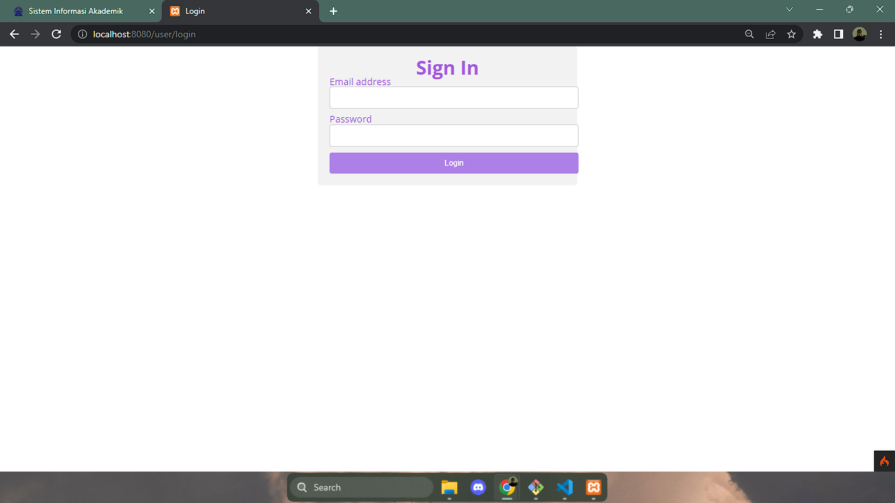
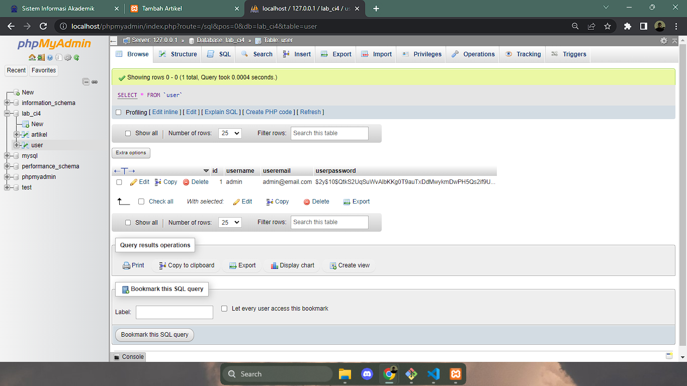
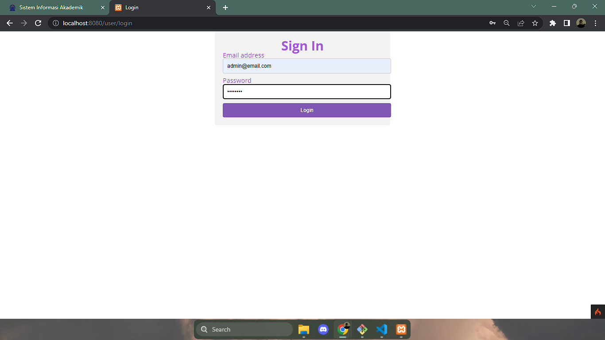
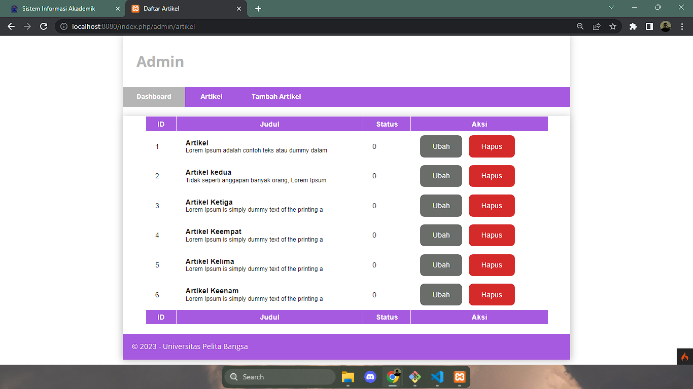
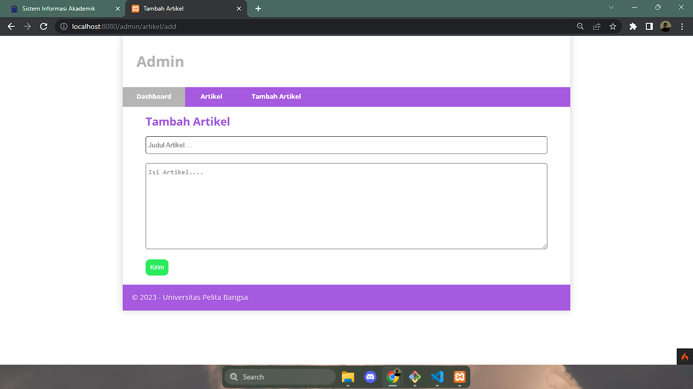
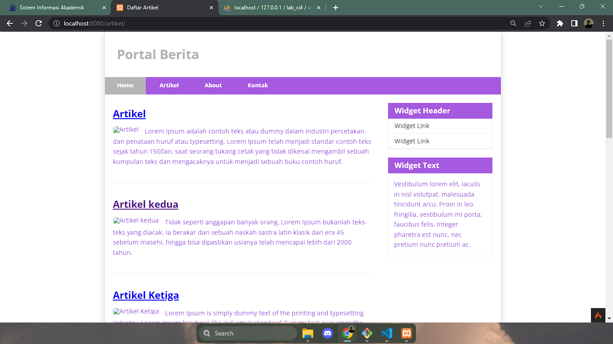

# Lab7Web-Login-Page

# PHP-CodeIgniter

This project is an assignment from my class
#### NIM : 312110103
#### Kelas : TI.21.A2
#### MatKul : Pemrograman Web 2

### Menambah fungsi login sebagai admin 


### Menambah Tabel User
```
CREATE TABLE user (
id INT(11) auto_increment,
username VARCHAR(200) NOT NULL,
useremail VARCHAR(200),
userpassword VARCHAR(200),
PRIMARY KEY(id)
);
```

### Melihat Tabel User
#### Data user di dapat ketika kita membuat Userseed



### Hasil Page Login

### Test Login

### Berhasil Masuk

### Membuka data Artikel Bukan Admin

